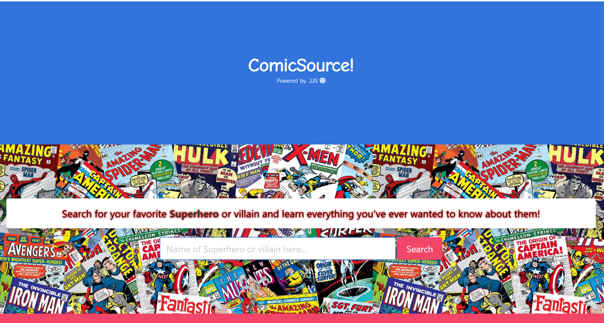

# ComicSource!
## Rutgers Coding Bootcamp Group Project #1
### Click here to open website.
## Group #5 Team Members:
#### [Saqueb Khan](https://github.com/SaquebKhan)
#### [Jorge Viera](https://github.com/Jorgevier)
#### [Jamie Kaczor](https://github.com/JamieKaczor)

We all love superheroes.  We all love movies.  Here at ComicSource!(powered by: JJS) we cut through all the bs for you and get straight to the stats.  Could Iron Man take on Wonder Woman and survive?  Would Spider-man flush Aquaman down the toilet?  The good news is, now you can simply search our site, compare a few heroes and find out for yourself...and the best part, we supply you with the top movie associated with your favorite heroes and villains to watch them in action.  And if all of that wasn't enough, we've even furnished our site with a proprietary(patent pending) Superpower! bar...it's that easy, click the button, get a superpower, everybody wins.  Come for the heroes, stay for the powers!

## Technologies Used:
- HTML5
- CSS3
- Bulma CSS Framework
- Javascript
- JQuery
- Google Fonts

## APIs Used:
- SuperHero API
- OMDb API

